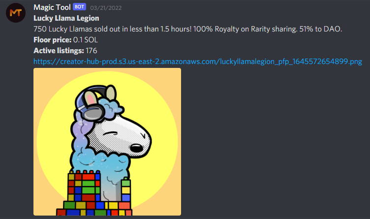
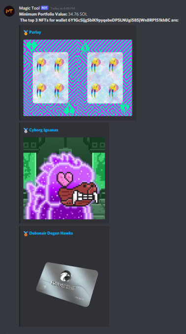
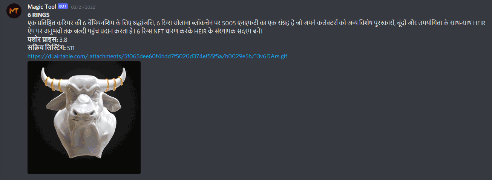
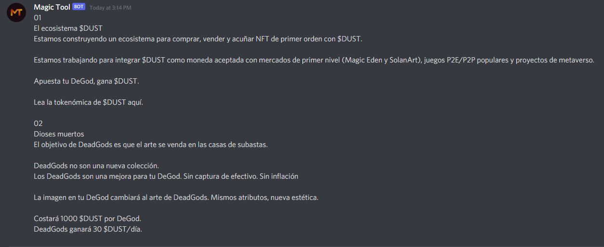

# Magic Tool
A Discord bot using the Magic Eden API to provide you with real-time information for your favorite NFT project in a language you understand. Looking to make the NFT space more accesible to people around the globe.

# Capabilities
Users have access to information such as:
- Collection description
- Current floor price
- Active listings
- Minimum portfolio value for a given wallet
- Top NFTs determined by floor price for a given wallet
- Localized roadmap for a collection

All within Discord with simple commands and in over 100 different languages thanks to the Google Translate API

# Supported Commands
|Command | Description |
|--------|-------------|
|!collection <collection_name> | Displays collection statistics such as description, floor price, and active listings for specified collection. This will be sent in the channel specified language
|!portfolio <wallet_address> | Displays the minimum portfolio value for a given wallet with a ranking of top 3 NFT's owned with highest floor price |
|!set_language <language_code> | Sets the language for the specific channel. All future commands from Magic Tool in this channel will return information in the specified language. Default value is en |
|!set_roadmap <roadmap>| Sets the roadmap for your server that can be translated depending on the language set for the channel this command is ran on |

# Parameters
| Parameter | Description |
|-----------|-------------|
|<collection_name> | Name that is found after the marketplace/ on a Magic Eden marketplace url |
|<wallet_address> | Solana wallet Address |
|<language_code> | iso639-1 language codes for [supported languages](https://py-googletrans.readthedocs.io/en/latest/) |
| < roadmap > | Roadmap for your project collection |

# Example Usage
### ```!collection luckyllamalegion``` will show: 



### ```!portfolio 6gjFy9Gp3mMN8uTLtfAyMmxdDfUe74YTo8cUTDXJtBUH``` will show:



### ```!set_language hi``` will give you a confirmation and future commands in the text channel will show:



### ```!set_roadmap <roadmap>``` followed by a ```!roadmap``` in a channel where ```!set_language es``` was ran will show:


